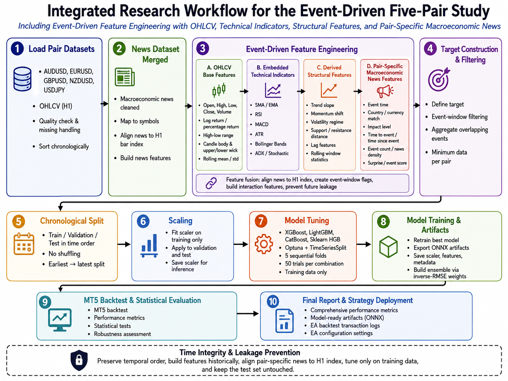
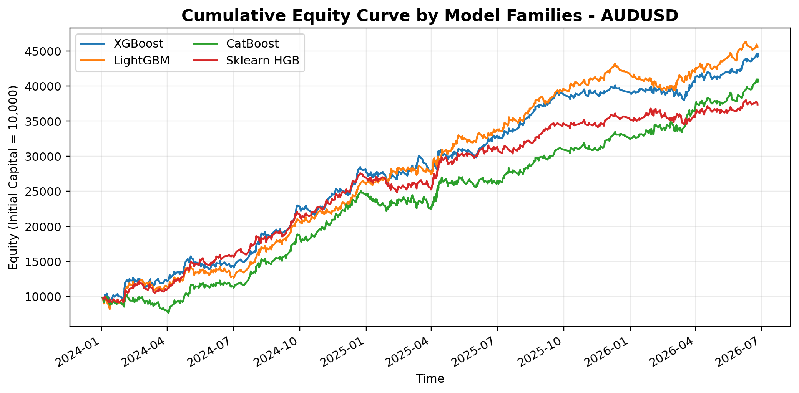
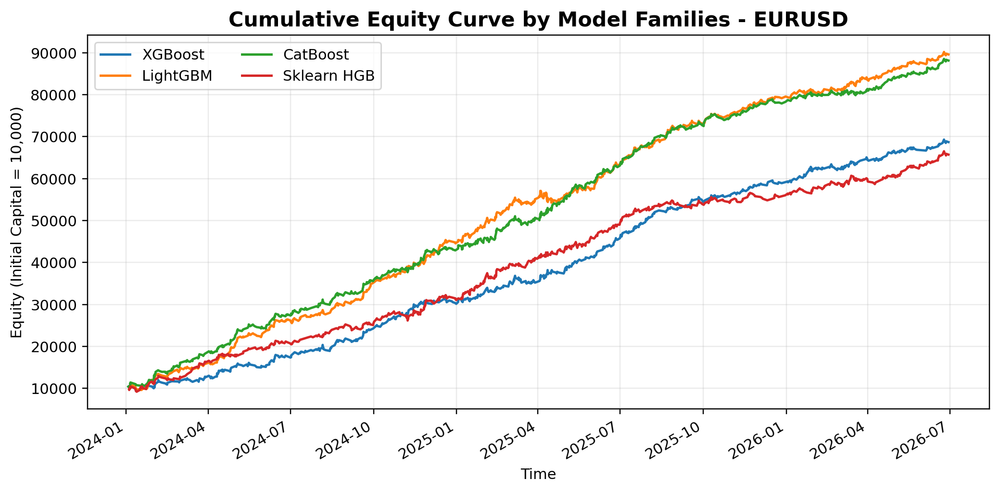
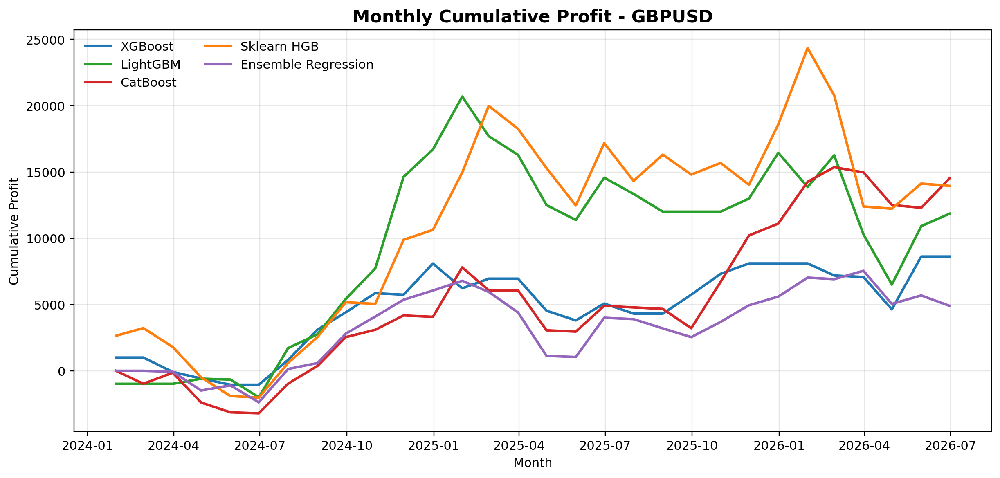
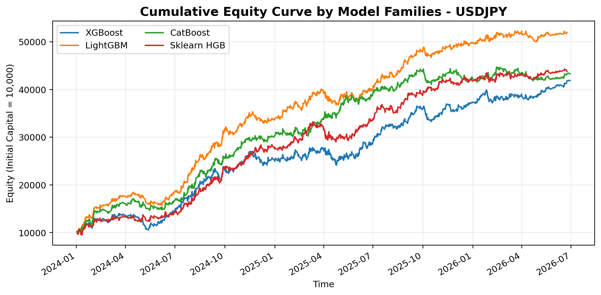

# RegressionEA

`RegressionEA` is an event-driven foreign exchange forecasting and trading project for MetaTrader 5. The project trains hyperparameter-tuned boosting-based regression models on H1 market data, enriches them with technical and macroeconomic-event features, exports ONNX artifacts, and executes a news-aware MQL5 Expert Advisor in MT5.

This repository snapshot is aligned with the current four-pair study:

- `AUDUSD`
- `EURUSD`
- `GBPUSD`
- `USDJPY`

The current design combines:

- H1 OHLCV price data exported from MT5
- technical indicators already embedded in the dataset files
- lightweight derived price and volatility features
- numerical macroeconomic-event features built from exported news CSV files
- leakage-safe train-test splitting
- Optuna-based hyperparameter tuning
- ONNX deployment for MT5 simulation and trading

## Research Workflow

The current end-to-end workflow used by the project is summarized below.

## Repository Layout

- `src/`
Contains the Python pipeline for feature processing, target construction, tuning, training, evaluation, ONNX export, and MT5 runtime export.

- `mql5/`
Contains the active Expert Advisor source used for event-driven ONNX inference and MT5-side transaction logging.

- `Assets/`
Contains the tracked project-level runtime snapshot for the published four-pair scope, including ONNX models, thresholds, scaler parameters, and the latest transaction CSVs mirrored from the MT5 Common folder.

## Data Scope

The published workflow uses a leakage-aware chronological split. Training is driven by historical OHLCV datasets and a train-side news CSV covering `2018-01-01` to `2023-12-31`, while MT5 simulation and forward-style testing use later news files and chart-by-chart indicator values generated directly inside Strategy Tester. The training pipeline remains event-driven rather than bar-driven, and observations are retained only within the configured `0H` to `+2H` post-news window.

## Feature Design

The active feature space combines four layers:

1. MT5 H1 market inputs:
- `open`
- `high`
- `low`
- `close`
- `tick_volume`

2. Dataset-level technical indicators:
- examples include `rsi`, `atr`, `macd`, `bollinger bands`, `stochastic`, `adx`, and time-context fields such as `hour` and `day_of_week`

3. Derived structural features:
- `body`
- `upper_wick`
- `lower_wick`
- `log_return`
- `volatility_20`

4. Numerical macroeconomic-event features:
- event presence and event count
- maximum event importance
- nearest time offset
- base-currency and quote-currency aggregates for `actual`, `forecast`, `previous`
- surprise terms for `actual - forecast` and `actual - previous`

## Modeling Workflow

The current workflow is:

1. Load the H1 pair dataset from the local MT5 dataset export folder
2. Reuse technical indicators already present in the dataset
3. Add lightweight derived features
4. Load the aligned macroeconomic news CSV
5. Build pair-specific numerical news features
6. Create the delayed one-step-ahead regression target
7. Keep only event-window observations
8. Fit preprocessing only on training data
9. Tune each model family with Optuna
10. Train final models
11. Estimate model-specific thresholds from training predictions
12. Export ONNX and runtime artifacts to `Assets/`
13. Run the MQL5 EA for MT5 simulation or execution

## Model Families

The current benchmark set includes:

- `xgboost`
- `lightgbm`
- `catboost`
- `sklearn_hgb`
- `voting`

The `voting` model is retained as the ensemble regression benchmark.

## Batch Entry Points

Main training command:

- `start_training.bat`

`start_training.bat` is the primary entry point for the current four-pair training pipeline.

## MT5 Runtime Artifacts

The main repository-level runtime folder is:

- `Assets/`

The MT5 runtime mirror is:

- `%APPDATA%\MetaQuotes\Terminal\Common\Files\Regression_Assets`

This repository keeps `Assets/` as the tracked project snapshot. For publication, only the active four-pair artifacts (`AUDUSD`, `EURUSD`, `GBPUSD`, `USDJPY`) are mirrored back from the MT5 Common folder so the repository remains reproducible without depending on runtime-only storage.

## What Is Published

The GitHub snapshot is intended to include:

- source code in `src/` and `mql5/`
- runtime artifacts in `Assets/`
- latest transaction CSVs inside `Assets/` for audit and comparison
- project batch files and supporting markdown notes

## What Is Not Published

Some files are intentionally kept local and excluded from GitHub:

- compiled MT5 binaries (`*.ex5`)
- Python cache files
- local compile logs such as `metaeditor_compile.log`
- reference PDFs and non-project reading material
- local datasets, processed data, training outputs, and report workspaces

These exclusions are for cleanliness and repository relevance only. Local files are not deleted by this setup.

## Dependencies

The current Python environment expects packages listed in `requirements.txt`, including:

- `pandas`
- `numpy`
- `scikit-learn`
- `optuna`
- `xgboost`
- `lightgbm`
- `catboost`
- `joblib`
- `matplotlib`
- `seaborn`
- `MetaTrader5`
- `onnx`
- `skl2onnx`

Some ONNX conversion paths may also require `onnxmltools`.

## Current EA

The active Expert Advisor source is:

- `mql5/ML_Regression_EA_Live.mq5`

The EA is designed to:

- load ONNX models from the exported runtime artifacts
- read the configured news CSV from the MT5 Common folder
- trade only during relevant macroeconomic-event windows
- apply model-specific thresholds
- log transaction history for later evaluation

## Trading Result Visuals

The repository also includes cumulative equity curves from the MT5 simulation-based evaluation for the four published currency pairs.

### AUDUSD

### EURUSD

### GBPUSD

### USDJPY

